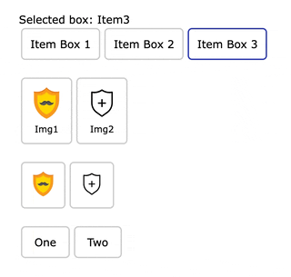

[](https://github.com/hassan-jahan/vue-cool-box-selector/blob/master/license.md)
[](https://standardjs.com)

## Vue Cool Box Selector ✅

[//]: # (🪄✨)

[//]: # (> [Demo →]&#40;https://stackblitz.com/edit/vitejs-vite-e7qhxx?file=src%2FApp.vue&#41;)

[](https://standardjs.com)

Versatile element selector for vue. It can convert anything to a checkbox button.

## Features

- Flexible, choose from any element (division, button, image or custom component)
- Headless, use our provided style or your own classes
- Works with Vue 2 and 3
- Lightweight ~1KB gzipped

[//]: # (  - [pnpm]&#40;https://pnpm.js.org/en/installation&#41;)

[//]: # (## tag git history)

[//]: # (#$ git tag v0.0.1 -m 'v0.0.1')

[//]: # (#)

[//]: # (## push tag to git)

[//]: # (#$ git push origin --tags)

## Usage

### Setup

```bash
npm install vue-cool-box-selector
##OR
yarn add vue-cool-box-selector
##OR
pnpm i vue-cool-box-selector
```
**Note:** Use version 2 for Vue 2 

### Global Use

```js
import VueCoolBoxSelector from 'vue-cool-box-selector'

// Optional, you can use your own classes
import 'vue-cool-box-selector/dist/style.css'

// For Vue 2
import Vue from 'vue'

Vue.use(VueCoolBoxSelector)

// or Vue 3
app.use(VueCoolBoxSelector)
```

### Local Use

```js
import { CoolBoxItem, VueCoolBoxSelector } from 'vue-cool-box-selector'

const component = {
  components: {
    VueCoolBoxSelector,
    CoolBoxItem,
  },
}
```

### Basic Usage

```vue
<div>
Selected box: {{ selected }}
<VueCoolBoxSelector v-model="selected" active-class="cb__active">
  <CoolBoxItem name="Item1" class="vue-cool-box-selector__item" key="1">
    Item Box 1
  </CoolBoxItem>
  <CoolBoxItem name="Item2" class="vue-cool-box-selector__item" key="2">
    Item Box 2
  </CoolBoxItem>
  <CoolBoxItem name="Item3" class="vue-cool-box-selector__item" key="3">
    Item Box 3
  </CoolBoxItem>
</VueCoolBoxSelector>
</div>
```

### Another Example

```vue
<!-- replace cb__square with cb__circle or cb__triangle for more styles -->
<VueCoolBoxSelector v-model="selected" active-class="cb__active cb__square">
<CoolBoxItem key="1" name="Item1" class="vue-cool-box-selector__item px-3" style="width:48px;text-align:center">
  
  <small>Img1</small>
</CoolBoxItem>
<CoolBoxItem key="2" name="Item2" class="vue-cool-box-selector__item px-3" style="width:48px;text-align:center">
  
  <small>Img2</small>
</CoolBoxItem>
</VueCoolBoxSelector>
```

## Props

- VueCoolBoxSelector
    - active-class (String): Will be added to the item if it is selected.
    - tag (String) (Default: 'div')

- CoolBoxItem
    - name (String) (Required)
    - tag (String) (Default: 'div')

## Style

- VueCoolBoxSelector class:
    - vue-cool-box-selector__item
        - Require if you want to use below classes
- CoolBoxItem active-class:
    - cb__active
    - cb__active, cb__active-square
    - cb__active, cb__circle
    - cb__active, cb__triangle

## Change Style Color

```css
/* vue-cool-box-selector color */
.cb__active, .cb__triangle:before {
    border-color: violet; /* var(--bs-primary) */
}

.cb__square:after, .cb__circle:after, .cb__triangle:after {
    background-color: violet; /*  var(--bs-primary) */
}
```

[//]: # (** Note that provided active classes require vue-cool-box-selector__item or position:relative for items to work correctly.)

## Cheers

Love my works? give me 🌟 or follow for more works! → [Follow me on Github](https://github.com/sponsors/hassan-jahan)


[//]: # (Your support means a lot to me. It will help me sustain my projects actively and make more of my ideas come true. <br>)

[//]: # (Much appreciated! ❤️ 🙏)

[//]: # (→ [Github]&#40;https://github.com/sponsors/hassan-jahan&#41;<br>)

## Requirement

- node.js  > 14

## Thanks

- Faizal Andyka for vivu-npm
- Anthony Fu for vue-demi

## License

MIT License © 2023 Hassan Jahan
